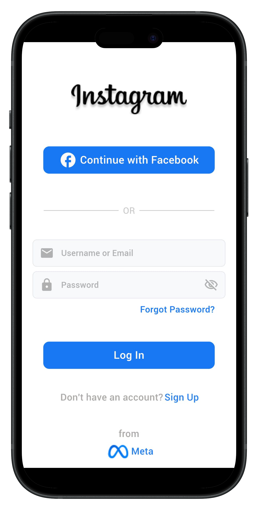

# Instagram Login Screen

## Overview

This project is a Flutter application that replicates the Instagram login screen. It features a clean and user-friendly interface similar to the original Instagram login page, with options for Facebook login, email login, and a Sign Up link.

## Features

- **Instagram Logo**: Displays the Instagram logo at the top of the screen.
- **Facebook Login Button**: Provides an option to log in using Facebook.
- **Email Login Fields**: Includes fields for entering a username or email and a password.
- **Forgot Password Link**: A link for users who forgot their password.
- **Log In Button**: A button to log in with the provided credentials.
- **Sign Up Link**: A link for new users to create an account.
- **Meta Branding**: Displays the Meta logo at the bottom of the screen.

## Screenshot

Here's how the login screen looks:

